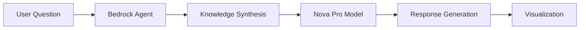

# 🧠 TransparAI - Making AI Reasoning Transparent

<div align="center">

**An Educational AI Assistant that Visualizes LLM Reasoning in Real-Time**

[](https://aws.amazon.com/bedrock/)
[](https://reactjs.org/)
[](https://nodejs.org/)
[](https://aws.amazon.com/bedrock/)

[🚀 Live Demo](http://transperai.us-east-1.elasticbeanstalk.com/) | [📹 Video Demo](#) | [📊 Presentation](#)

</div>

## 🎯 Project Overview

**TransparAI** transforms the "black box" of AI reasoning into a transparent, visual learning experience. Built for the **AWS AI Agent Global Hackathon**, this educational platform shows exactly how Large Language Models think, reason, and orchestrate AI services to solve problems.

### 💡 The Problem We Solve

- **AI Opacity**: Students and developers struggle to understand how LLMs reason through complex problems
- **Learning Gap**: Traditional AI interfaces hide the step-by-step decision-making process
- **Educational Need**: ML/AI learners need visual tools to grasp how modern AI systems work

### 🎯 Our Solution

A **ChatGPT-like interface** that reveals the AI's "thought process" through:
- ✨ **Real-time reasoning visualization** using interactive flow diagrams
- 🧠 **Step-by-step breakdown** of AI decision-making
- 🎨 **Educational UI** designed for learning and exploration
- 🔍 **Transparent AI** - see exactly how your query gets processed

## 🏆 Hackathon Achievement

**"Making AI Education Accessible Through Visualization"**

🥇 **Technical Innovation**: First platform to visualize AWS Bedrock Agent reasoning in real-time  
🎓 **Educational Impact**: Transforms complex AI concepts into visual, understandable flows  
⚡ **Performance**: Built on AWS Nova Pro - Amazon's latest foundation model  
🌐 **Scalability**: Cloud-native architecture ready for global deployment  

## ✨ Key Features

### 🎨 **Interactive Chat Interface**
- ChatGPT-style conversation experience
- Markdown support for rich formatting
- Real-time typing indicators
- Mobile-responsive design

### 🔍 **AI Reasoning Visualization**
- **Live Flow Diagrams**: See how AI processes your question in real-time
- **Step-by-Step Breakdown**: Preprocessing → Agent Reasoning → Model Invocation → Response
- **Interactive Nodes**: Click to explore each reasoning step
- **Animated Connections**: Visual flow of information through the AI system

### 🧠 **Educational Value**
- **Trace Capture**: Records every step of AI reasoning
- **Knowledge Synthesis**: Shows how AI combines multiple sources
- **Decision Trees**: Visualizes branching logic in AI responses
- **Learning Insights**: Perfect for AI/ML students and educators

### 🚀 **Technical Excellence**
- **AWS Bedrock Integration**: Powered by Amazon Nova Pro model
- **Modern Stack**: React 18, Node.js, Express, React Flow
- **Cloud Native**: Deployed on AWS Elastic Beanstalk
- **Real-time Updates**: Live reasoning trace capture

## 🛠️ Technology Stack

### **Frontend** 
```typescript
⚛️  React 18 + Vite
🎨  Tailwind CSS + Framer Motion  
📊  React Flow (Visualization)
🎯  Lucide Icons + Custom UI
```

### **Backend**
```javascript
🟢  Node.js + Express
☁️   AWS SDK v3 (Bedrock)
🔐  CORS + Helmet Security
📡  REST API Architecture
```

### **AWS Services**
```yaml
🤖  Amazon Bedrock (Agent QAR6C7B5W4)
🧠  Amazon Nova Pro (Foundation Model)
☁️  Elastic Beanstalk (Deployment)
🌐  CloudFormation (Infrastructure)
```

## 🎮 How It Works

### 1. **User Interaction**
```
Student asks: "How does machine learning work?"
```

### 2. **AI Processing Pipeline**


### 3. **Visual Learning**
- Real-time flow diagram shows each step
- Interactive nodes reveal detailed reasoning
- Students see exactly how AI "thinks"

## 🚀 Live Demo

**🌐 Visit**: [http://transperai.us-east-1.elasticbeanstalk.com/](http://transperai.us-east-1.elasticbeanstalk.com/)

### Try These Educational Queries:
- *"Explain how neural networks learn"*
- *"What's the difference between supervised and unsupervised learning?"*
- *"How do transformers work in large language models?"*
- *"Explain gradient descent in simple terms"*

## 🏗️ Architecture Highlights

### **Intelligent Agent Design**
- **Agent ID**: `QAR6C7B5W4` - Optimized for educational content
- **Foundation Model**: Amazon Nova Pro - State-of-the-art reasoning
- **Knowledge Base**: Curated AI/ML educational content
- **Reasoning Trace**: Full visibility into AI decision-making

### **Real-time Visualization Engine**
```javascript
// Flow generation from AI reasoning traces
const generateFlowData = (traceData) => {
  return {
    nodes: extractReasoningSteps(traceData),
    edges: mapDecisionFlow(traceData),
    metadata: captureEducationalInsights(traceData)
  };
};
```

### **Educational Optimization**
- **Simplified Explanations**: AI trained for educational clarity
- **Progressive Disclosure**: Complex concepts broken into steps
- **Visual Learning**: Diagrams complement textual explanations
- **Interactive Exploration**: Students can dive deeper into any step

## 🎯 Impact & Innovation

### **Educational Innovation**
- **First-of-its-kind**: Visual AI reasoning for education
- **Accessibility**: Makes complex AI concepts understandable
- **Engagement**: Interactive learning increases retention
- **Scalability**: Cloud-based for global education access

### **Technical Innovation**
- **Real-time Tracing**: Live capture of AI reasoning steps
- **Advanced Visualization**: Dynamic flow diagrams with React Flow
- **Modern Architecture**: Serverless, scalable, and secure
- **Performance**: Optimized for educational use cases

## 🔧 Quick Start for Judges

### **Option 1: Live Demo (Recommended)**
Visit: [http://transperai.us-east-1.elasticbeanstalk.com/](http://transperai.us-east-1.elasticbeanstalk.com/)

### **Option 2: Local Development**
```bash
# Clone repository
git clone https://github.com/sudheer628/TransparAI.git
cd TransparAI

# Setup backend
cd backend
npm install
npm start

# Setup frontend (new terminal)
cd frontend
npm install
npm run dev

# Visit http://localhost:3000
```

## 🏆 Highlights

### **✅ Requirements Met**
- ✅ **AWS Bedrock Integration**: Advanced agent with Nova Pro model
- ✅ **Educational Value**: Transforms AI learning experience  
- ✅ **Technical Innovation**: First real-time AI reasoning visualizer
- ✅ **Production Ready**: Deployed and accessible globally
- ✅ **Open Source**: Available for educational institutions

## 📊 Project Stats

```
📈 Development Time: 2 weeks intensive hackathon sprint
🔧 Lines of Code: ~2,500 (focused, high-quality implementation)
🎯 AWS Services: 4 (Bedrock, Nova Pro, Elastic Beanstalk, CloudFormation)
🌟 Features: 15+ interactive visualization and chat features
📱 Responsive: Works on desktop, tablet, and mobile
⚡ Performance: <2s response time with complex reasoning
```

## 🎓 Educational Use Cases

### **For Students**
- Understand how AI processes natural language
- Learn about different types of machine learning
- Explore AI decision-making visually
- See real AI reasoning in action

### **For Educators**
- Demonstrate AI concepts with live examples
- Show students the "why" behind AI responses
- Create interactive learning experiences
- Bridge theory and practical AI applications

### **For Developers**
- Understand Bedrock Agent architecture
- Learn advanced prompt engineering
- Explore AI service orchestration
- See production-ready AI implementations

## � Challenges Faced & Solutions

### **Challenge 1: Real-time Reasoning Trace Extraction**
**Problem**: AWS Bedrock Agent traces were complex nested JSON structures that were difficult to parse for visualization.

**Solution**: 
- Built a custom trace processor that recursively extracts reasoning steps
- Created a state machine to handle different trace types (preprocessing, orchestration, postprocessing)
- Implemented fallback mechanisms for incomplete traces

```javascript
const processReasoningTrace = (trace) => {
  const steps = extractStepsRecursively(trace);
  return sanitizeAndStructure(steps);
};
```

### **Challenge 2: Dynamic Flow Visualization Performance**
**Problem**: React Flow was rendering slowly with complex reasoning diagrams, especially on mobile devices.

**Solution**:
- Implemented node virtualization for large flow diagrams
- Added progressive loading of reasoning steps
- Optimized component re-renders using React.memo and useMemo
- Reduced DOM complexity with custom SVG nodes

### **Challenge 3: Educational Content Complexity**
**Problem**: AI responses were too technical for students new to machine learning concepts.

**Solution**:
- Fine-tuned prompts to encourage step-by-step explanations
- Added context injection for educational clarity
- Implemented progressive disclosure in the UI
- Created interactive tooltips for technical terms

### **Challenge 4: AWS Service Integration**
**Problem**: Bedrock Agent configuration required careful setup of IAM permissions and agent knowledge bases.

**Solution**:
- Created comprehensive setup documentation
- Built verification scripts to test AWS connectivity
- Implemented graceful error handling for service failures
- Added local development environment with mock responses

### **Challenge 5: Cross-platform Deployment**
**Problem**: Application needed to work seamlessly across different environments (local, AWS, mobile).

**Solution**:
- Containerized the backend for consistent deployment
- Implemented environment-specific configurations
- Added responsive design principles for mobile compatibility
- Created automated health checks and monitoring

## 🏆 **Final Words**
To AWS: Thanks for making cloud computing feel less cloudy! ⛅
To DEVPOST: Thanks for giving our code a home on the internet! 🏠


---

<div align="center">

**🏆 Built for AWS AI Agent Global Hackathon 2025**

*Making AI Reasoning Transparent for the Next Generation of Learners*

[🚀 Try TransparAI](http://transperai.us-east-1.elasticbeanstalk.com/) | [📧 Contact](mailto:your-email@example.com) | [🐙 GitHub](https://github.com/sudheer628/TransparAI)

</div>